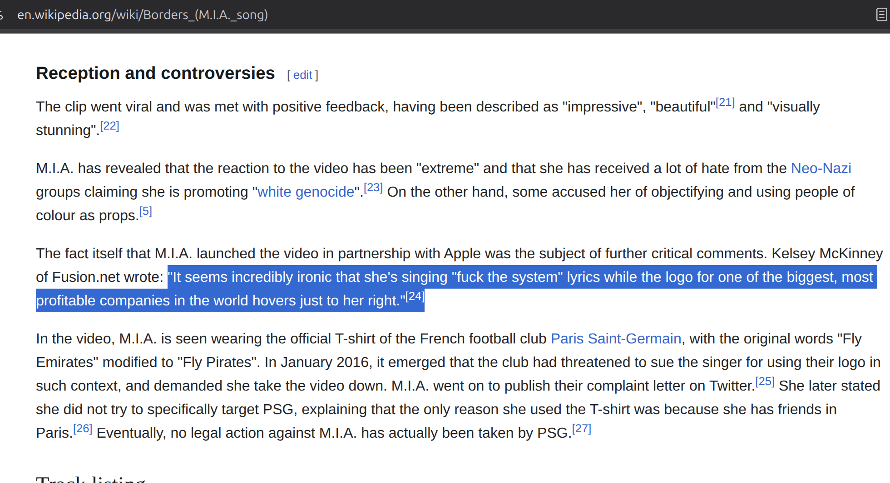

# Border Songs

This repository is a book of poetry. I'm not kidding, that's not a metaphor, that's literally what I'm doing here.

This is a long-standing project in my head. I had the privilege of participating in [Kernel](https://www.kernel.community) Block X, and I took advantage of that framework to finally rip off the band-aid, *tira*ndome a la piscina.

There is a theme that is threaded through popular music, a very old theme in fact, which I find becomes much clearer in translation. When I've worked on this enough to explain it succinctly, I'll update this. Maybe. Or you'll have to read the book, idk, *but*:

>
> **it has to do with the limit, the border: the lines we can cross, and the lines we can't.**
>

## Live Demo

You can see a staging version of the book [here](https://mapachurro.github.io/border-songs/).

<!-- START doctoc generated TOC please keep comment here to allow auto update -->
<!-- DON'T EDIT THIS SECTION, INSTEAD RE-RUN doctoc TO UPDATE -->

- [Border Songs](#border-songs)
  - [Live Demo](#live-demo)
  - [What is wrong with you, why is nodejs involved in writing a book](#what-is-wrong-with-you-why-is-nodejs-involved-in-writing-a-book)
- [Full track listing](#full-track-listing)
  - [Songs of the limit; Canciones limítrofes](#songs-of-the-limit-canciones-limítrofes)
    - [Full track listing](#full-track-listing-1)
      - [Reach the pass](#reach-the-pass)
      - [Behold the valley beyond](#behold-the-valley-beyond)
      - [Alcanzar la ribera](#alcanzar-la-ribera)
- [Desde la otra costa](#desde-la-otra-costa)
- [Scope Creep](#scope-creep)
  - [Colorable claim to this project](#colorable-claim-to-this-project)
  - [idk](#idk)
  - [Partially credible claim](#partially-credible-claim)
  - [Songs about the Casino State](#songs-about-the-casino-state)
    - [Current inclusions](#current-inclusions)
    - [Inter-thematic neural network](#inter-thematic-neural-network)
- [Meta-structures](#meta-structures)
  - [Straight analysis](#straight-analysis)
  - [Translation analysis](#translation-analysis)
  - [Gonzo](#gonzo)
  - [Legal briefing](#legal-briefing)

<!-- END doctoc generated TOC please keep comment here to allow auto update -->

## What is wrong with you, why is nodejs involved in writing a book

I have an idea about how I want this text to be visually represented, and stored (*immutably?*), and iterated upon (*how many writers have wanted the experience of merkle tries for their drafts, and just didn't know they could?*), and therefore, the medium with which I will be binding this book will be JAVASCRIPT.

# Full track listing

There's a structure and organization to this work which follows the logic of the theme itself. This is recursive, deconstructive logic, take it or leave it. Each section in the [binder](./binder/) will have an individual track listing inside it, `track-list-{number}.md`. 

## Songs of the limit; Canciones limítrofes

<!-- BEGIN FULL TRACKLIST -->

### Full track listing

<strong>Tracklist 01 – 01-reach-the-pass</strong>

#### Reach the pass
00 - Wasn't born to follow - Gerry Goffin, Carole  King, Roger McGuinn

01 - El Paso - Marty Robbins  
02 - Viva las Vegas - Doc Pomus, Mort Shuman; Jello Biafra  
03 - Waylon Jennings Live! - John Darnielle  
04 - Cielito Lindo - Trini Lopez
05 - Free Mexican Air Force - Peter Rowan  
06 - Mexicali Blues - Bob Weir  
07 - Romance in Durango - Bob Dylan, Jacques Levy
08 - Return of the Grievous Angel - Tom Brown, Gram Parsons

<strong>Tracklist 02 – 02-behold-the-valley-beyond</strong>

#### Behold the valley beyond
00 - Crossing The Bar, Alfred, Lord Tennyson

01 - Boulder to Birmingham - Emmylou Harris  
02 - Farther Along - Traditional (?), The Byrds  
03 - At the dark end of the street - Gram Parsons   
04 - Tangled Up In Blue - Bob Dylan  
05 - Wild Horses - Gram Parsons, Keith Richards (?)  
06 - Landslide - Stevie Nicks  
07 - Just a Season - Roger McGuinn, Jacques Levy    
08 - The Road - Emmylou Harris

<strong>Tracklist 03 – 03-alcanzar-la-ribera</strong>

#### Alcanzar la ribera
00 - Mama dame cien pesetas - Rafaella Carrà  

01 - Malagueña salerosa - Traditional, Chingón  
02 - Buscando América - Ruben Blades  
03 - Fast Car - Tracy Chapman v. Eric Combs  
04 - Visa para un sueño - Juan Luis Guerra  
05 - Caminos Verdes - Ruben Blades  
06 - Washington Bullets - The Clash  
07 - Pa'l Norte - Calle 13

<strong>Tracklist 04 – 04-desde-la-otra-costa</strong>

# Desde la otra costa
00 - Clandestino - Manu Chao
 
01 - Hotel California - The Eagles v. the Gipsy Kings  
02 - Why you'd want to live here - Ben Gibbard  
03 - Juan Luis Guerra - El costo de la vida  
04 - El hormiguero - Calle 13  
05 - Frijolero - Molotov  
06 - Desaparecido - Manu Chao  
07 - Dancing in the Dark - Springsteen v. Juanes  
08 - Volver - Carlos Gardel

<!-- END FULL TRACKLIST -->

# Scope Creep

## Colorable claim to this project
- `Deportee (plane wreck at Los Gatos)`
  - Nana Mouskouri in a French translation with title "Adieu mes amis" on Le Tournesol (1970)
- `Paper Planes` - MIA
  - This is, on the one hand, a song explicitly about economic disparities between Global North and South. It goes hand-in-hand with, eg., `El costo de la vida`.
  - It's also *literally* about falsifying visas and passports. 
  - *On the other hand*, I Have Misgivings. MIA is a terrible, terrible poser and I don't know if I can, in good faith, represent this song as a legitimate expression of anything except the chorus, which I believe would be transcribed as `"...All I want to do is $ $ $ $. And a check in my name."` 
    - *However*, `Hotel California` is currently part of the track listing, and **there are no greater posers in the history of popular music than the *fucking* Eagles.**
- `Borders` - MIA
  - See above. Also: 
  - 
- `Do You Know the Way to San Jose` - Dionne Warwick
  - This is pretty fire tbh. I think it goes alongside `I Can't See Why You'd Want to Live Here`.
  - `Friend of the Devil` - Robert Hunter

## idk
- Bella ciao

## Partially credible claim
- `Sprawl II (Mountains Beyond Mountains)`, `City with no Children`, `Half Light II (No Celebration)` - The Arcade Fire
  - These tracks, along with other songs by The Arcade Fire across multiple albums (`No Cars Go`) are, on the one hand, incredibly powerful expressions of the feeling of being trapped, the feeling of being Locked In The Belly of the Beast; the *limitlessness* of the suburban, modern life, and a searing indictment of the hipocrisy of the, for lack of a better term, Casino State. 
    - For example, from `City with no Children`: `... / But do you think your righteousness / Can pay the interest on your debt? / I have my doubts about it / I feel like I’ve been living in / A city with no children in it / A garden left for ruin by a millionaire inside / Of a private prison`
      - *On the other hand*, they are not explicitly Border Songs; they are, again arguably, *songs of the limit*, because they yearn *for* a limit. 
  - However, and this is a sort of meta-commentary, but: Especially on `The Suburbs` (the album overall), the lyricist(s) do this thing where they have presented a work that is coherent and connected, and tells a story *over the course of the entire album*. It's like a conversation between a couple of people, talking about stories and things that have happened over the course of their lives, and the stories and narratives thread in and out of the songs. Sometimes it's a few lines in a verse that refer to another song that more explicitly addresses the topic. There are frequent intertextual references to themes that are names of *other* songs on the album.
    - Thus, it would be very difficult to analyze any one track in isolation. `Sprawl II` may be the exception for the purposes of this project, but this may be a case where I am reaching to include a song that is deeply personally meaningful to me and resonates with lots of parts of my life and analyses that *do* form part of this project, but really, remain outside its scope.
    - Additionally: Half Light II *could* pair well with `Volver`, but... As much as I deeply love that song, I'm not sure it reaches the same echelon as Mr. Gardel's work.

## Songs about the Casino State

There is a theme that has crept into this project which has the potential to explode out into an entire body of coherent, inter-thematically connected work. 
These are songs about risk; about gambling; about failure and **rags-to-riches dreams of hitting it big.** Some are currently included in `Border Songs`.

### Current inclusions
- Mexicali Blues
- Viva Las Vegas
- Leaving Las Vegas

### Inter-thematic neural network
- Atlantic City - Bruce Springsteen
  - This song is capable of producing a decent-length analysis in and of itself
- House of the Rising Sun - Traditional / The Animals
- Deal - Robert Hunter
- Dire Wolf - Robert Hunter
- The Gambler - Kenny Rogers
- Friend of the Devil - Robert Hunter
- Half Light II (No Celebration) - The Arcade Fire
  - Lemme explain: `Now that San Francisco's gone / I guess I'll just pack it in / ... / When we watched the markets crash / The promises we made were torn / ... / Some people say / We've already lost / But they're afraid to pay the cost / For all we've lost / ...`

# Meta-structures

## Straight analysis
This work does require a straight, fact-based analysis of what's going on here. This structure will include English or Spanish-language contextual information, e.g. authorage, publication, well-known versions, close reading and comparisons between prominent versions.

## Translation analysis
Like it says on the tin. This may or may not be a separate structure from the straight analysis -- probably separate, or footnoted out from the straight analysis, as again, it's rooted in fact-based reality.

## Gonzo
Did you expect anything else. The tension throughout the work will be when and where the straight analysis will get absolutely derailed or subsumed in the gonzo take.

## Legal briefing
I'm not sure about the viability of this, but I find it very intriguing. One idea would be to mirror or follow the structure of an NTA:

1. You're not from here
2. You're from somewhere else
3. You crossed the line
4. You didn't have permission to cross the line

--> and you are now known to be illegal, and now you're facing the consequences

What's intriguing about this, in order to express the connection my mind is making: I created a four-part structure about crossing borders, in ~202...4? 5? while I was working in gambling, I mean, self-custodial cryptographic technology services. Now, it's 2026, and I'm back in Immigration Court, and it just strikes me how well they line up:

1. Fantasies and dreams about how dope it will be on the frontier or border - approaching the border - you're not from here
2. Finding out what it is you lost on `the other side` when you crossed the border - the valley beyond - You're from somewhere else
3. I fully intend on intentionally breaking the law and crossing the border because I have to survive - alcanzar la ribera - you crossed the line
4. Fuck. Well, fuck. I am now reaping what I sowed - desde la otra costa - you didn't have permission to cross the line

The way these things line up is, to a mind that works the way mine does, *striking*.